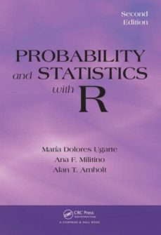

# Máster Universitario en Salud Pública

## Bioestadística / Curso 2026-27.

| Fecha        | Título                                                       |
|--------------|--------------------------------------------------------------|
| 05-octubre   | [Práctica 0: Introducción a `R`](./Practica0.html)           |
| 07-octubre   | [Práctica 1: Lectura y manejo de ficheros](./Practica1.html) |
| 21-octubre   | Práctica 2: Estadística descriptiva                          |
| 04-noviembre | Práctica 3: Contrastes paramétricos                          |
| 16-noviembre | Práctica 4: Regresión lineal                                 |
| 23-noviembre | Práctica 5: Asociación. Riesgos relativos y Odds Ratio       |
| 01-diciembre | Práctica 6: Regresión logística                              |
| 14-diciembre | Práctica 7: Análisis de supervivencia                        |
| 16-diciembre | Práctica repaso                                              |

## Bibliografía

Para la realización de esta práctica, puede consultarse el texto:

Ugarte, M.D., Militino, A.F., and Arnholt, A.T. (2016). *Probability and
Statistics with R (Second Edition)*. Chapman and Hall.

